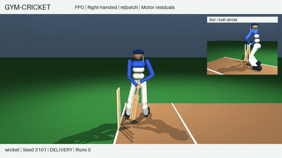
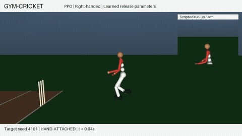

# mjbatch

## Humanoid Cricket by Kishan

This public fork is maintained by [Kishan (@kishanpb)](https://github.com/kishanpb)
for the [Gym-Cricket](https://github.com/kishanpb/gym-cricket) integration proposed
in [upstream PR #5](https://github.com/kevinzakka/mjbatch/pull/5).
The contribution is included on this fork's default branch; upstream acceptance
is separate. mjbatch is developed upstream by Kevin Zakka and contributors.

| Batting: right and left handed | Bowling: right and left handed |
| --- | --- |
| [](https://github.com/kishanpb/gym-cricket/releases/download/v0.1.1-mjbatch-preview/gym_cricket_mjbatch_humanoid_batting.mp4) | [](https://github.com/kishanpb/gym-cricket/releases/download/v0.1.1-mjbatch-preview/gym_cricket_mjbatch_humanoid_bowling.mp4) |

Click either preview for the full 42-second PPO/A2C reel with both hands,
misses, and 0.25x replays. These are retained-checkpoint transfers through native
CPU-batched integration, not new training or a speedup result. Stance, swing
reference, and running action retain scripted components.

The reproducible fixture contains 32 fixed episodes with exact serial-model parity;
the previews are highlights, not success-rate estimates.
[Run the example and inspect all results](examples/cricket_humanoid.md) |
[Source and checkpoints](https://github.com/kishanpb/gym-cricket/tree/2a6641ddc030407b10e2320f07d6b88a92e23072) |
[Related UniLab fork](https://github.com/kishanpb/Cricket-Gym-Unilab)

**Contact diagnostics:** [force and simulated-touch reporting](examples/cricket_humanoid.md#contact-forces-and-simulated-touch)
now covers the full fixed PPO/A2C replay, with per-contact force/torque, touch states
and explicit sensor-timing limits. This does not turn the scripted components into
learned robot control; a Unitree G1 cricket extension is the next milestone.

**Unitree G1 research:** [robot setup and complete results](examples/cricket_g1.md).
The companion UniLab task fits a bat-arm actor, then runs 24,576 PPO transitions
around a frozen external locomotion prior and rigid wrist bat. Native Batch
reproduces the full 576-row evaluation exactly; this is shared-task execution,
not a separately trained native Batch learner. BC qualifies on 2/24 right-hand
development contexts. PPO completes all 24 with blade contact and no guard
violations, but all fail the strict forward-speed target. Left-hand transfer is
untrained and fails; learned bowling and a robust both-hand showcase remain open.

[G1 development video with force/touch overlays](https://github.com/kishanpb/Cricket-Gym-Unilab/blob/7f936c78b9e0d882087be6deedadba4525bd7224/g1_cricket_results/bc_v1/learned_development_diagnostic.mp4)
and [six-view contact sheet](https://github.com/kishanpb/Cricket-Gym-Unilab/blob/7f936c78b9e0d882087be6deedadba4525bd7224/g1_cricket_results/bc_v1/learned_development_contact_sheet.png)
retain fixed contexts including failures. Loads are simulated and uncalibrated;
this is a diagnostic, not an advertising reel. Earlier highlights are unchanged.

The [bowling release foundation](examples/cricket_g1.md#bowling-release-foundation)
adds explicit held equality inputs and tests both G1 wrists in the shared task.
Release preserves ball position/velocity; the declared holder is not a learned
grasp, and a trained bowling demonstration remains unfinished.

The shared [experimental bowling task](examples/cricket_g1.md#bowling-task-and-force-audit)
now has arm/release controls and validated holder-force/touch signals. All 32
untrained carry/drop checks complete on the two CPU executors; these are not
learned or legally qualified deliveries.

The subsequent [both-hand PPO delivery pilot](examples/cricket_g1.md#both-hand-delivery-learning-pilot)
trains two fresh actors on native mjbatch, 24,576 transitions per hand. All 32
evaluation cases match across executors but retain the ball: zero qualified
deliveries. Failed checkpoints and complete evidence are retained, not promoted
as a new bowling showcase.

The [absolute-arm reach comparison](examples/cricket_g1.md#absolute-arm-reach-and-prior-target-guard)
now has three left-hand scripted raise-and-recovery witnesses after bounding
the shared task's locomotion-prior targets. All right-hand trials still fail
physical checks. These are one-seed preload diagnostics, not learned releases
or a new bowling showcase; all failed cases remain available.

The subsequent [fixed drive/release study](examples/cricket_g1.md#fixed-overarm-drive-and-release)
completes six left-hand scripted releases with stable recovery, but **zero
qualified deliveries**: maximum forward release speed is 3.13 m/s and every
first bounce falls short. This is development evidence, not a learned video.
The [signed elbow and reward audit](examples/cricket_g1.md#signed-elbow-and-release-reward)
closes an angle-folding loophole and adds an opt-in reward correction without
reclassifying those failed deliveries as successes.

---

[](https://github.com/kevinzakka/mjbatch/actions)
[](https://pypi.org/project/mjbatch/)

`mjbatch` is a Python library for running thousands of MuJoCo simulations in parallel on CPU.

Features include:

* C++ thread pool execution, with the GIL released;
* Live array access to simulation state and controls across the batch, with `bind` for MjData fields;
* Per-simulation model parameters, with `expand` for MjModel fields and `set_const` to recompute derived constants.

For example:

```python
import mujoco, numpy as np
from mjbatch import Batch

model = mujoco.MjModel.from_xml_path("scene.xml")
batch = Batch(model, num_sims=4096)  # threads default to every logical CPU
qpos, ctrl = batch.bind("qpos"), batch.bind("ctrl")
batch.expand("geom_friction")[:, :, 0] = np.random.uniform(0.4, 1.2, (4096, 1))
for _ in range(1000):
  ctrl[:] = policy(qpos)             # your controller, all 4096 at once
  batch.step()                       # step them in parallel; qpos updates in place
```

## Examples

We showcase a range of applications built using `mjbatch`: RL, MPC, SysID, and hardware
co-design. Each example is a self-contained, performant implementation. For instance, the Go1
RL controller learns to walk in under a minute on a five-year-old M1 laptop.

<table>
  <tr>
    <td align="center" width="50%">
      <a href="https://github.com/kevinzakka/mjbatch/blob/main/examples/cartpole_swingup.py"></a>
    </td>
    <td align="center" width="50%">
      <a href="https://github.com/kevinzakka/mjbatch/blob/main/examples/cartpole_mpc.py"></a>
    </td>
  </tr>
  <tr>
    <td align="center">A two-pole cart swung upright with <a href="https://ieeexplore.ieee.org/document/6386025">iLQR</a></td>
    <td align="center">A cart-pole swing-up controller using <a href="https://arxiv.org/abs/2212.00541">predictive sampling</a></td>
  </tr>
  <tr>
    <td align="center" width="50%">
      <a href="https://github.com/kevinzakka/mjbatch/blob/main/examples/g1_flip.py"></a>
    </td>
    <td align="center" width="50%">
      <a href="https://github.com/kevinzakka/mjbatch/blob/main/examples/go1_joystick.py"></a>
    </td>
  </tr>
  <tr>
    <td align="center">A G1 humanoid tracking a reference backflip with receding-horizon iLQR</td>
    <td align="center">A Go1 quadruped joystick controller trained with PPO</td>
  </tr>
  <tr>
    <td align="center" width="50%">
      <a href="https://github.com/kevinzakka/mjbatch/blob/main/examples/arm_throw.py"></a>
    </td>
    <td align="center" width="50%">
      <a href="https://github.com/kevinzakka/mjbatch/blob/main/examples/rizon_inertia.py"></a>
    </td>
  </tr>
  <tr>
    <td align="center">CEM jointly optimizes a robot arm's proportions, gears, and controls</td>
    <td align="center">Damped Gauss–Newton fits a Rizon arm's inertial parameters to synthetic motion data</td>
  </tr>
</table>

Run with `uv run examples/<file>.py`; some need `uv sync --group examples`. The ones that open
a window need a display; `--headless` runs the solver without one.

### Humanoid Cricket Integration

[`cricket_humanoid.py`](examples/cricket_humanoid.py) replays retained PPO/A2C
checkpoints for right- and left-handed batting and running-bowling drills through
native CPU-batched integration. It checks serial parity and preserves scripted
motion and learned-control labels; it is not a throughput or new-training result.
See the [pinned setup, videos, model limits, and tests](examples/cricket_humanoid.md).

## License

Apache-2.0.
