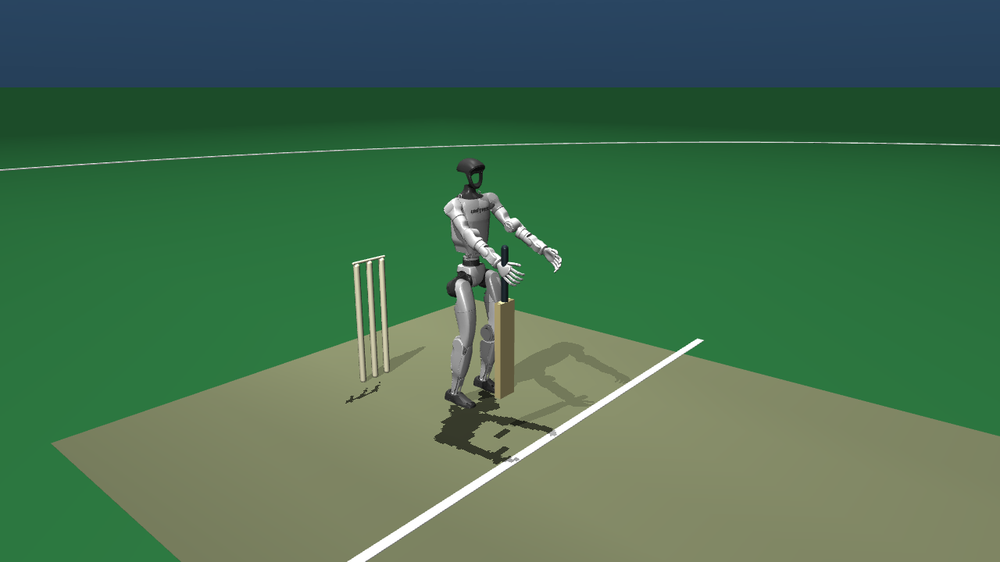
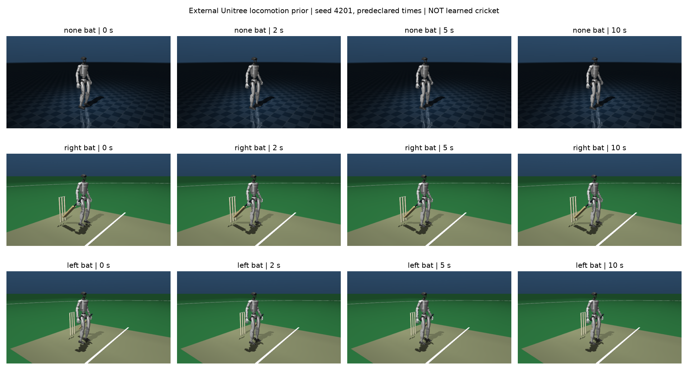
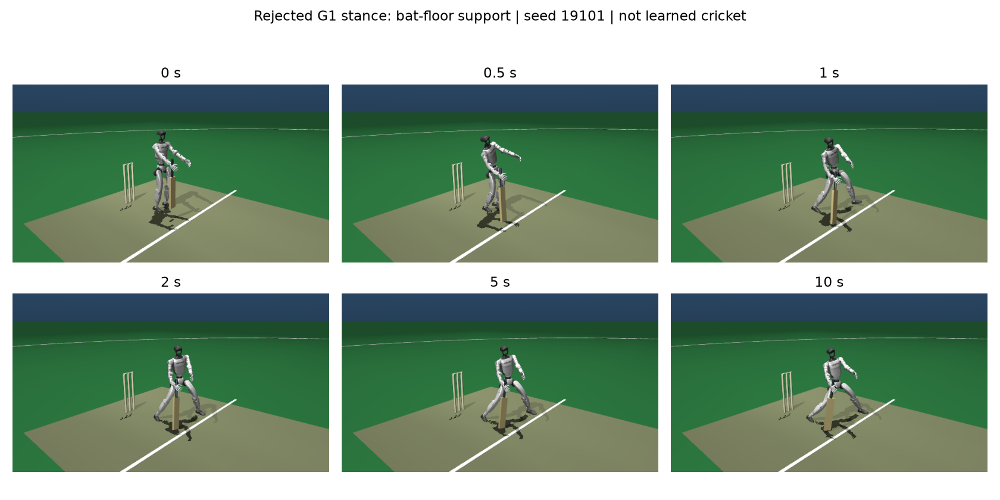

# Unitree G1 Cricket Development

This is a **floating-base robot-learning foundation**, not a finished cricket
policy or replacement for the existing humanoid highlights. The native mjbatch
environment preserves the Menagerie G1's 29 joint actuators, link inertias,
joint limits and actuator-force limits. There is no root support constraint,
gravity compensation or step-time pose overwrite.



The pinned `unitree_g1/g1_mjx` asset is BSD-3-Clause, tree
`57c00d310bfd8ae7d5676c64b959c86fbdd61d20`. It has articulated wrists but fixed
hands. The 1.12 kg bat is a **rigid single-wrist fixture**, not a learned grasp.
The ball is a free 0.156 kg sphere with 36 mm radius. A marked pitch, both wickets
and an outfield boundary provide cricket context; regulation delivery/no-ball
gates are not implemented yet. The incoming ball's initial velocity is a declared
bowling-machine reset condition, not learned bowling.

## Reproduce

```sh
uv sync --python 3.13 --group examples
uv pip install --python .venv/bin/python stable-baselines3==2.7.1
uv run --no-sync python -m pytest tests/test_cricket_g1.py tests/test_cricket_g1_train.py -q
uv run --no-sync python examples/cricket_g1.py --audit examples/cricket_g1_results/physical_baseline.json
uv run --no-sync python examples/cricket_g1_train.py \
  --output examples/cricket_g1_results/balance_ppo_right --steps 524288
```

MuJoCo 3.11.0 and mujoco-menagerie 2026.9.0 were used for the retained results.
Training uses Stable-Baselines3 PPO or A2C, not a custom algorithm. The CPU runner
uses 32 native environments, four physics workers and two Torch threads. PPO has
two 128-unit hidden layers, 64 rollout steps per environment, batch size 256,
five epochs, learning rate 0.0003 and training seed 1. Control runs at 50 Hz with
ten 2 ms physics substeps. A2C is supported by the runner but is not yet benchmarked.

Each action is a bounded 29-joint target offset from the reset pose. The balance
reward tracks uprightness and height, penalizes drift, action changes, posture
deviation and joint-limit violations, and terminates on falls. `--task batting`
adds provisional ball-distance/contact shaping; that objective is **not validated**
and no trained batting result is currently claimed.

Observations include simulator joint/root state, privileged ball state, the last
action, bat position, foot support loads and fixture wrench. This is not a
vision-only or deployable hardware sensing setup. Kinematic/sensor fields are
from the final physics substep's evaluation stage, which precedes the resulting
integrated state by one step; no extra forward force solve replaces those samples.

## External Locomotion Prior

The next route uses Unitree's **externally trained** 29-DoF G1 velocity policy,
not one of our failed stance checkpoints. The pinned
[Unitree RL Lab source](https://github.com/unitreerobotics/unitree_rl_lab/tree/4960b84732b0c2ec593dccbfe963fda1bcd7b1e3)
provides `deploy/robots/g1_29dof/config/policy/velocity/v0/exported/policy.onnx`
and its paired `params/deploy.yaml`. No cricket training or vendor pretraining
performed locally is claimed. We do not redistribute these two external assets:
the upstream README advertises Apache-2.0 but the pinned tree has no root license
file; checkpoint redistribution has not been cleared.

The adapter verifies both SHA-256 hashes before inference. Its 480 inputs use
pelvis-frame angular velocity and projected gravity, zero velocity commands,
joint positions/velocities in the official policy order, and previous raw actions.
Each term contains five frames, oldest first, initialized by repeating the first
frame. Policy output is mapped back to all 29 native joints. Official SDK-order
PD gains, policy-order default pose and 20 ms control are explicit changes from
our custom stance controller. Robot inertias, collision pairs, joint/torque limits,
free base and 2 ms physics remain intact; there is no elastic band, gravity
compensation or pose overwrite after reset. Targets are bounded by native joint
limits; no retained prior step required that clipping.

All eight predeclared seeds (4201-4208, joint-reset jitter +/-0.005 rad) were run
for each of three models and two controllers, with a ten-second horizon:

| Model | Constant default target | External Unitree policy |
| --- | --- | --- |
| No bat | 8/8 falls, 1.234-1.280 s | 8/8 completed 10 s |
| Right wrist fixture | 8/8 falls, 1.330-1.396 s | 8/8 completed 10 s |
| Left wrist fixture | 8/8 falls, 1.330-1.396 s | 8/8 completed 10 s |

[All 48 rows](cricket_g1_results/unitree_prior/evaluation.json) retain failures,
contact counts/loads, state extrema, runtime and source hashes. Every physics
step matches an independent serial MuJoCo shadow exactly in qpos/qvel. All 24
prior trials have no incidental bat contact, no non-foot robot-ground contact,
no joint-limit excess and no applied joint-torque-limit violation. Maximum XY
drift is 0.016 m; minimum pelvis height is 0.7869 m. This is narrow zero-command
transfer evidence, not robustness certification, a matched PPO/A2C comparison,
or a learned batting/bowling result. The bat pose is not a cricket-ready stance.



Reproduce after obtaining the pinned files from the source above in a local
cache outside this checkout; pass that directory, containing `policy.onnx` and
`deploy.yaml`, as `--assets`. No checkpoint download occurs implicitly:

```sh
uv pip install --python .venv/bin/python onnxruntime==1.30.0 pyyaml==6.0.3
uv run --no-sync python examples/cricket_g1_prior.py --assets /path/to/local/cache \
  --output examples/cricket_g1_results/unitree_prior/evaluation.json
uv run --no-sync python -m pytest tests/test_cricket_g1_prior.py -q
```

The optional integration tests use the macOS cache
`~/Library/Caches/unitree_rl_lab/4960b84732b0c2ec593dccbfe963fda1bcd7b1e3` and
skip if those external assets are absent. Report/schema and hash-rejection tests
remain separate. Physics-step sensor timing is unchanged; fixture/contact data
remain simulated, uncalibrated signals, not hardware tactile measurements.

## Height Observation Comparison

`--observe-root-height` appends pelvis height relative to the 0.78 m target,
changing the input from 117 to 118 values without changing physics or reward.
New checkpoints record this contract and restore it on resume; an incompatible
checkpoint/input shape is rejected rather than silently reinterpreted. Old
checkpoints and the default observation remain unchanged.

Two fresh seed-1 PPO runs used 524,288 transitions each, fixed action std 0.08,
target KL 0.02, learning rate 0.0003 and the same free-bat contact guard:

| Observation | All eight deterministic development trials |
| --- | --- |
| Original 117 inputs | Contact failure at 0.72-0.74 s; 0 successes |
| Height-aware 118 inputs | Contact failure at 0.70 s; 0 successes |

[Original evidence](cricket_g1_results/observation_comparison/original/evaluation.json)
and [height-aware evidence](cricket_g1_results/observation_comparison/height/evaluation.json)
retain every row and both training curves. This budget does not establish a
height-observation benefit or a solved stance. Different input widths also
change seeded network initialization; this is not an independently replicated
causal comparison. Neither candidate advanced to the ten-second gate.

Reproduce either arm with `examples/cricket_g1_train.py`, `--steps 524288`,
`--forbid-bat-contact --fixed-action-std .08 --target-kl .02 --learning-rate .0003`
and a distinct `--output`; add `--observe-root-height` only for the height arm.

## Contact Evidence

Explicit pairs cover ball/bat, robot, ground and stumps, plus bat/robot and ground
collisions. The fixture intentionally excludes bat collisions with its holding
palm/wrist. Original robot self-collision pairs are retained. Geometry-level
contact records report force, torque, distance, position and contact frame;
normal loads and contact-presence counts are sampled after every physics step.
Presence uses the sensor's `found` field, including zero-normal-load contacts;
it is not inferred from a positive force threshold.
Both feet expose support records. Fixture force/torque sensors include gravity
and inertial loads, not finger pressure or hardware tactile taxels.

Tests compare native stepping against serial MuJoCo exactly, preserve original
robot inertias/motor parameters, verify selective reset, demonstrate gravity
without actuation, and exercise a controlled incoming-ball contact. These tests
verify integration and instrumentation, **not realistic impact magnitudes**.
Timestep/contact-parameter convergence and calibration remain required.

The [16-case timestep audit](cricket_g1_results/contact_timestep_audit.json) retains
both hands at 2 and 8 m/s over four stepsizes from 2 ms to 0.25 ms. Coarse versus
finest peak normal loads differ by 4.84-9.20%; summed normal impulses differ by
0.35-2.11%. These are controlled short impacts on the free robot with constant
joint targets, not learned shots. The current critically damped contact has very
little rebound; restitution/material calibration is still a prerequisite for
credible batting dynamics. Numerical agreement alone does not supply it.

[Allen et al. (2014)](https://shura.shu.ac.uk/8205/) validated cricket ball/bat
impacts experimentally and found limitations in rigid-body predictions across
blade locations. This motivates a separate rebound/contact-duration calibration
study; their data are not a calibration of this wrist fixture or MuJoCo model.

## Results And Limits

**Current physical gate: not passed.** A later PPO checkpoint stayed upright for
all eight three-second development trials and all eight ten-second stress trials,
but the added bat-ground sensors exposed support loads up to 1,364 N. It was using
the bat as a crutch. This is rejected as a cricket stance, not a promoted result.



The [complete physical audit](cricket_g1_results/balance_ppo_fine/balance_validation.json)
separates the no-fall gate from the cricket-stance gate. The new free-bat curriculum
terminates on any incidental bat-ground or bat-body contact; the declared holding
wrist fixture is excluded geometrically. Ball/bat contact remains allowed.
Do not compare its returns directly with the older, unguarded curriculum.

| Development condition | Additional transitions | Deterministic outcome |
| --- | ---: | --- |
| Fixed action std 0.08 from bootstrap | 524,288 | 8/8 falls, 1.88-2.68 s |
| Same parent/std plus PPO target KL 0.02 | 524,288 | 5/8 falls; only 3/8 reach 3 s |
| Continue KL checkpoint at learning rate 0.0001 | 524,288 | 0/8 falls at 3 s and 10 s, rejected for bat support |
| Free-bat v2 continuation, same physics | 262,144 | 8/8 invalid bat contacts, 1.00-1.04 s; 0 successes |
| Continue free-bat v2, unchanged contract | 1,048,576 | 8/8 falls, 1.88-2.70 s; no incidental bat contacts, 0 successes |
| Further free-bat v2 continuation | 1,048,576 | 7/8 contact failures, 1/8 fall, 1.82-2.16 s; 0 successes |

The frozen-noise and KL settings use Stable-Baselines3's existing PPO policy and
update stopping logic. These are bounded development comparisons, not a final
tournament, independently seeded training replication or an algorithm ranking.
The second unchanged continuation regressed and is not promoted. More budget
has not established contact-free balance; the next investigation is the stance
observation/control contract rather than another unchanged continuation.
Both continuation evaluations replay exactly after the contact-presence guard
fix. Their saved training-source hashes describe the implementation at commit
`b487c9d`; the subsequent guard correction did not retrain the checkpoints.

The complete first-episode evaluations use development seeds 9001-9008, all eight
rows retained. These repeated development seeds are not an untouched final test
set. The constant-target baseline falls after about 0.9 s; the initial 524,288-step
PPO checkpoint lasts 2.02-2.12 s but still falls in all eight trials. See
[evaluation](cricket_g1_results/balance_ppo_right/bootstrap_evaluation.json) and
[development history](cricket_g1_results/experiment_history.md). Longer continuation
results are kept separately from that parent checkpoint.

The continuation to 1,572,864 total transitions regressed to 1.56-1.66 s with
eight falls out of eight, despite a training-episode average near 144 control
steps. The [complete continuation evaluation](cricket_g1_results/balance_ppo_right/evaluation.json)
is retained, not promoted. The action-sampling diagnostic below investigated
that training/evaluation mismatch.

A [fixed-seed action-sampling probe](cricket_g1_results/balance_ppo_right/action_sampling_probe.json)
reproduces both deterministic evaluations exactly. Sampled actions reduce falls
to 5/8 for the parent and 6/8 for the continuation, but still fail the balance
gate. It retains all 32 diagnostic episodes, not selected successful examples.

Before advertising learned cricket, the remaining gates are sustained balance,
both-handed bat interception and strike attribution, physical bowling/release,
full PPO/A2C comparison without selected episodes, joint/torque and foot-fault
audits, impact sensitivity checks, and videos of actual learned control.
The current UniLab prototype has a different 0.70 kg fixture and control period;
cross-framework policy/performance parity is not established.
Both handed scenes now align the bat, incoming ball and wicket line; the pitch,
creases and boundary center mirror with them. Tests cover this alignment and
the previous right-hand checkpoint evaluation replays exactly. Left-handed
learned batting is not established.
