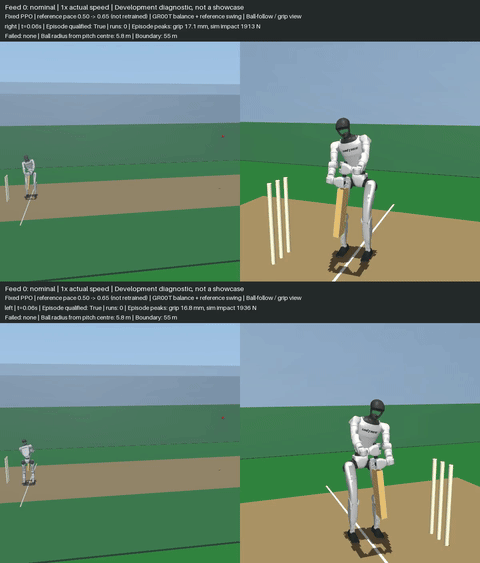
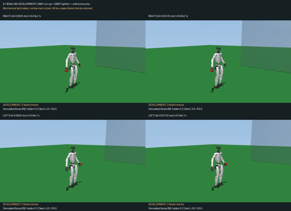

# Unitree G1 Cricket

**Development videos and complete-cohort results, not a finished robot policy release.**
The earlier cricket demonstrations remain available in the repository README.

| Batting: both hands | Bowling: overarm and underarm |
| --- | --- |
|  |  |

The batting reel is 67.2 seconds: all seven feeds for both hands, complete
normal-speed episodes and 0.25x contact/miss replays. The 30.56-second bowling
reel preserves overarm first, then underarm; each style shows both hands and
both physics resolutions with normal-speed action and slow replay. GIFs are
short navigation previews, not extra trials or success-rate estimates.

## What Was Learned

Batting uses a 112,000-step SKRL PPO residual policy with frozen GR00T balance
and a reference swing. Reference pace was changed from 0.50 to 0.65 **after**
training; this is not newly learned shot power. The articulated hands use
physical finger contacts and capped servo control, not a learned grasp policy.

Bowling combines frozen AMP/GR00T locomotion with reference arm motion and a
mechanical ball holder. Running policies are learned; the bowling arms and
release controller are not end-to-end learned cricket skills. There is no
per-step reference-pose teleportation or injected release velocity.

The videos replay retained native MuJoCo states on a UniLab-derived G1 scene.
Live native `mjbatch.Batch.step` evaluations reproduce every retained array
and outcome across all fourteen batting cases and eight bowling cases, with
live policy inference and per-substep control. The same motion is therefore
shown once, not presented as two independently trained results. This is a
single-simulation-per-worker equivalence check, not a batching speedup result.

## Complete Results

| Evaluation | Result | Remaining limits |
| --- | --- | --- |
| Batting, 14 cases | 8 physically qualified one-pitch contacts; 10 physical passes; 0 boundaries | 4 grip failures and 3 guard-return failures; counts overlap |
| Forward batting shots | 6 qualified forward drives, 16.98-17.13 m from pitch centre including roll | The other 2 qualified contacts are backward glances; boundary radius stays 55 m |
| Overarm, 4 cases | All release and recover upright within native limits | 0 pass full delivery qualification; early/repeated bounce and target-corridor failures remain |
| Underarm, 4 cases | Airborne downrange carry 3.72-3.84 m versus 1.90-1.99 m overarm | Less total travel after 4 seconds; not regulation bowling without prior agreement |

Underarm uses a different release guard (3 m/s plus 25-degree upward loft,
versus overarm's 6 m/s guard), so this is not a single-variable performance
claim. These are limitations of the current controller/setup, not established
G1 hardware ceilings. No hardware or sim-to-real validation is claimed.

Contact diagnostics include simulated contact forces, finger loading/slip,
holder forces/impulses and foot support loads. They are simulated quantities,
not hardware tactile taxels. Native motor caps and absence of external support
are checked; passing those checks does not clear grip or cricket-law failures.

[`evidence.json`](evidence.json) retains every evaluated row and failure, media
hashes, checkpoint hash and backend-comparison counts. The
[portable runtime](../g1_cricket_runtime/README.md) includes the controller,
our batting checkpoint and installers for external assets. Its evaluation
commands regenerate raw per-substep traces, which are not shipped with the videos.
Do not infer that these videos alone complete the integration or legal-bowling goal.

Check downloaded file integrity from this directory with `uv run --no-project
python verify.py`. This verifies package hashes and cohort membership, not the
underlying physics or a fresh policy rollout.

## Credits

- Unitree G1 robot assets: [Unitree Robotics](https://github.com/unitreerobotics/unitree_ros).
- Balance controller: [NVIDIA GR00T-WholeBodyControl](https://github.com/NVlabs/GR00T-WholeBodyControl).
- Running policy: [AMP Running baseline](https://github.com/Jiarui-Xie/AMP_Running_baseline).
- Scene/task work: [UniLab](https://github.com/unilabsim/UniLab), [mjbatch](https://github.com/kevinzakka/mjbatch), and [Gym-Cricket](https://github.com/kishanpb/gym-cricket).

This preview does not redistribute external checkpoints or robot meshes and
does not imply endorsement by those projects or upstream PR acceptance.
